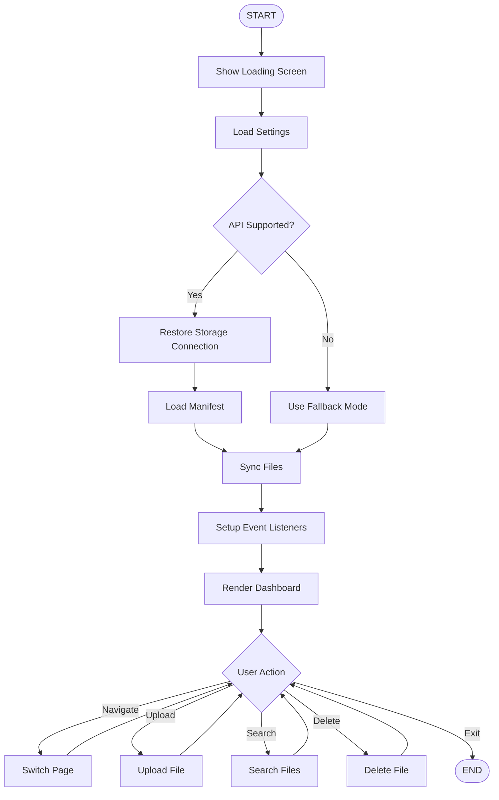
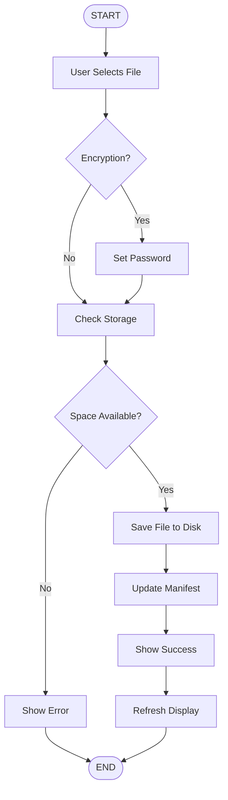
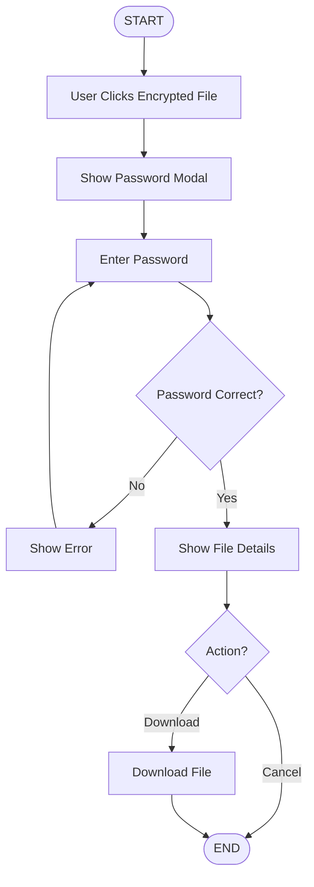
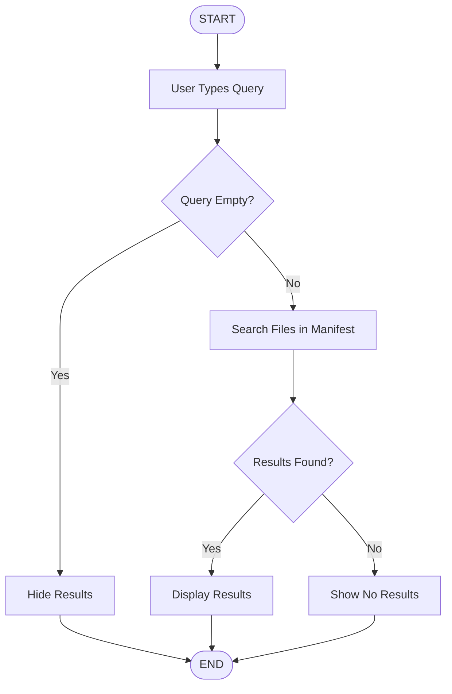
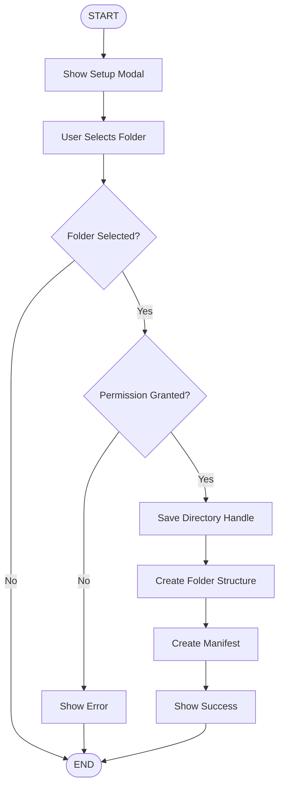
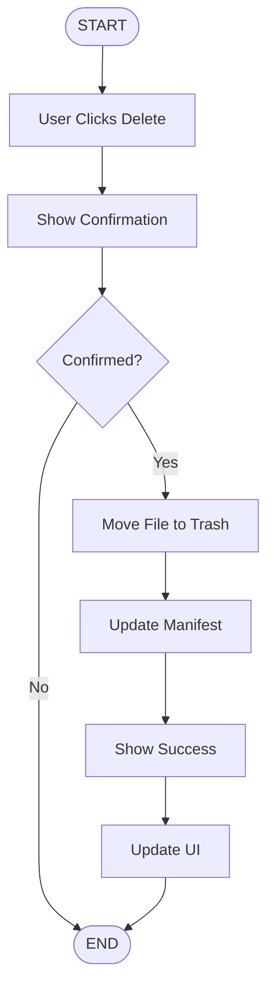
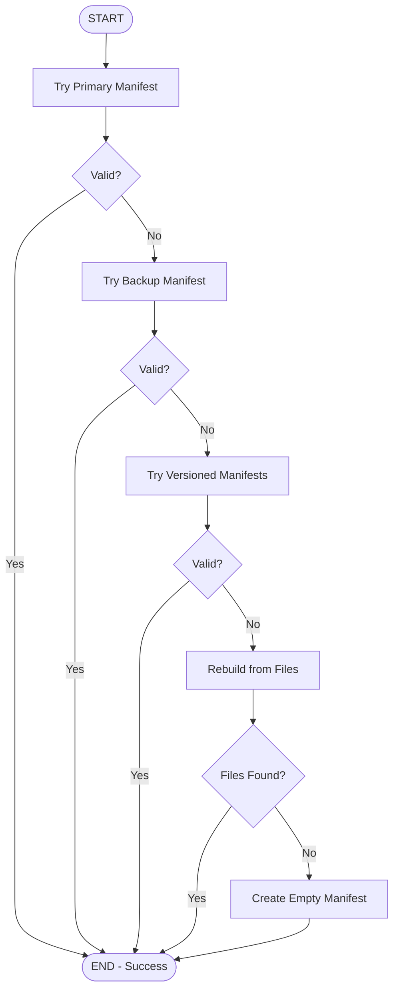
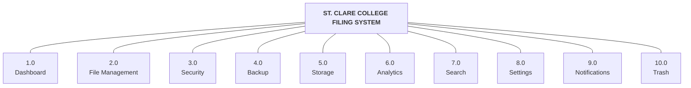

# APPENDICES (Updated December 16, 2025)

DFD Diagram
  Context Diagram
	Exploded Diagram


## APPENDIX B: PROGRAM FLOWCHART

### Main Application Flowchart

This flowchart illustrates the overall flow of the St. Clare College Filing System from application startup to user interaction. It shows how the system initializes, checks for File System API support, restores storage connections, and handles the main event loop for user actions.

**[INSERT DIAGRAM - Use the Mermaid code below in mermaid.live to generate]**



---

### File Upload Flowchart

This flowchart shows the step-by-step process when a user uploads a file to the system. It includes the decision points for encryption, password validation, storage quota checking, and the write queue system for HDD-friendly batched saves.

**[INSERT DIAGRAM - Use the Mermaid code below in mermaid.live to generate]**



---

### Encrypted File Access Flowchart

This flowchart demonstrates the security verification process when a user attempts to access an encrypted file from the Secure folder, including password validation and file retrieval.

**[INSERT DIAGRAM - Use the Mermaid code below in mermaid.live to generate]**



---

### Search Flowchart

This flowchart shows how the system processes search queries and displays results to the user in real-time as they type, searching through both regular files and secure files from the manifest.

**[INSERT DIAGRAM - Use the Mermaid code below in mermaid.live to generate]**



---

### Storage Setup Flowchart

This flowchart illustrates the first-time storage configuration process using the File System Access API, including folder selection, permission handling, manifest creation, and storage space detection.

**[INSERT DIAGRAM - Use the Mermaid code below in mermaid.live to generate]**



---

### File Deletion Flowchart (Soft Delete with Trash)

This flowchart shows the soft delete process where files are moved to a trash folder instead of being permanently deleted, allowing for recovery.

**[INSERT DIAGRAM - Use the Mermaid code below in mermaid.live to generate]**



---

### Manifest Recovery Flowchart

This flowchart shows the 5-level recovery chain for loading the manifest file, ensuring data integrity and automatic recovery from corruption.

**[INSERT DIAGRAM - Use the Mermaid code below in mermaid.live to generate]**



---

## APPENDIX C: VTOC DIAGRAM (Visual Table of Contents)

### System Module Hierarchy

The VTOC diagram presents the hierarchical structure of all modules in the St. Clare College Filing System. It shows the main system broken down into functional modules, with each module further divided into sub-modules representing specific functionalities.

**[INSERT DIAGRAM - Use the Mermaid code below in mermaid.live to generate]**



---

### Module Description Table

| Module | Sub-Module | Function Description |
|--------|------------|---------------------|
| **1.0 Dashboard** | | |
| | 1.1 Statistics Display | Shows total documents, secure files, recent files, and storage usage |
| | 1.2 Recent Activity | Displays list of recent user actions with timestamps from audit log |
| | 1.3 Quick Actions | Provides shortcut buttons for common operations |
| **2.0 File Management** | | |
| | 2.1 Upload Handler | Processes file uploads via drag-drop or file browser |
| | 2.2 File Display | Renders files in grid or list view format |
| | 2.3 Download Handler | Retrieves files from storage and triggers download |
| | 2.4 Soft Delete Handler | Moves files to trash folder instead of permanent deletion |
| | 2.5 File Filter | Filters files by type (documents, images, etc.) |
| | 2.6 Auto-Organize | Automatically sorts files into appropriate folders by type |
| **3.0 Security** | | |
| | 3.1 Password Input | Handles custom password entry with validation |
| | 3.2 Password Generator | Creates secure 12-character random passwords |
| | 3.3 Strength Checker | Calculates and displays password strength (Weak/Fair/Good/Strong) |
| | 3.4 File Encryption | Marks files as encrypted and stores password in manifest |
| **4.0 Backup** | | |
| | 4.1 Export Handler | Serializes manifest data to JSON and triggers download |
| | 4.2 Import Handler | Parses backup JSON and restores system state |
| | 4.3 Validation | Verifies backup file integrity using checksums |
| | 4.4 Versioned Snapshots | Creates timestamped manifest versions for recovery |
| **5.0 Storage** | | |
| | 5.1 File System Service | Manages File System API connection and operations |
| | 5.2 Manifest System | Replaces old index with checksummed manifest |
| | 5.3 Write Queue | Batches disk writes for HDD-friendly operation (30s intervals) |
| | 5.4 Atomic Writes | Uses temp file + verify + rename pattern for data safety |
| | 5.5 Recovery System | 5-level recovery chain for corrupted manifests |
| | 5.6 Folder Manager | Creates and maintains folder structure |
| | 5.7 Quota Monitor | Tracks storage usage against limits |
| | 5.8 Fallback Handler | Manages localStorage for unsupported browsers |
| **6.0 Analytics** | | |
| | 6.1 Statistics Calculator | Computes file counts and storage metrics from manifest |
| | 6.2 Usage Display | Renders visual storage usage indicators |
| | 6.3 Audit Log | Tracks upload, delete, and restore statistics |
| **7.0 Search** | | |
| | 7.1 Query Processor | Parses and normalizes search input |
| | 7.2 File Matcher | Compares query against file metadata in manifest |
| | 7.3 Result Renderer | Displays matching files with highlighting |
| **8.0 Settings** | | |
| | 8.1 Theme Manager | Handles dark/light mode switching |
| | 8.2 Storage Settings | Configures storage folder and limits |
| | 8.3 Organization Settings | Manages auto-organize preferences |
| | 8.4 Browser Detection | Detects and displays current browser compatibility |
| **9.0 Notifications** | | |
| | 9.1 Toast Handler | Displays success, error, and info messages |
| | 9.2 Badge Counter | Updates notification count indicator |
| | 9.3 Activity Logger | Records user actions to audit log in manifest |
| **10.0 Trash** | | |
| | 10.1 Trash Display | Shows soft-deleted files with deletion timestamps |
| | 10.2 Restore Handler | Recovers files from trash to original location |
| | 10.3 Permanent Delete | Removes files from trash permanently |
| | 10.4 Empty Trash | Bulk delete all files in trash |

---

## APPENDIX D: IPO DIAGRAM (Input-Process-Output)

### IPO Chart 1: File Upload

| INPUT | PROCESS | OUTPUT |
|-------|---------|--------|
| File object from user (via drag-drop or file browser) | 1. Validate file type and size | File saved to disk in appropriate folder |
| Encryption flag (enabled/disabled) | 2. Check available storage quota against manifest settings | Updated manifest entry with metadata |
| Password (if encryption enabled) | 3. Determine target folder based on file type (auto-organize) | Success notification displayed |
| | 4. Generate unique file identifier | Audit log entry created |
| | 5. Write file to disk using atomic write pattern | Dashboard statistics updated |
| | 6. Generate SHA-256 checksum for verification | Change queued for batch save |
| | 7. Create metadata object (ID, name, size, type, date, folder) | |
| | 8. Update manifest with new file entry | |
| | 9. Queue change for batched disk write | |

---

### IPO Chart 2: File Download

| INPUT | PROCESS | OUTPUT |
|-------|---------|--------|
| File ID (from user click action) | 1. Look up file metadata in manifest | Downloaded file to user's computer |
| Password (required if file is encrypted) | 2. Check if file has encrypted flag in manifest | Audit log entry created |
| | 3. If encrypted, display password modal | |
| | 4. Verify entered password against manifest stored value | |
| | 5. Read file content from appropriate folder | |
| | 6. Create blob URL for download | |
| | 7. Trigger browser download dialog | |

---

### IPO Chart 3: File Deletion (Soft Delete)

| INPUT | PROCESS | OUTPUT |
|-------|---------|--------|
| File ID (from delete button click) | 1. Find file metadata in manifest | File moved to _trash folder |
| User confirmation (Yes/No dialog) | 2. Display confirmation dialog to user | Original file removed from source |
| | 3. Read file from source folder | Manifest updated with deletion info |
| | 4. Generate unique trash filename with timestamp | deletedAt timestamp recorded |
| | 5. Write file to _trash folder | Original location preserved for restore |
| | 6. Delete original file from source folder | Success notification displayed |
| | 7. Update manifest: set deleted=true, record deletedAt | Change queued for batch save |
| | 8. Move entry to trash section of manifest | |
| | 9. Queue change for batched save | |

---

### IPO Chart 4: File Restore from Trash

| INPUT | PROCESS | OUTPUT |
|-------|---------|--------|
| File ID (from restore button in trash) | 1. Find file in manifest trash section | File restored to original folder |
| | 2. Get original folder location from metadata | Manifest updated |
| | 3. Read file from _trash folder | File removed from trash |
| | 4. Write file to original folder with original name | Success notification displayed |
| | 5. Delete file from _trash folder | Statistics updated |
| | 6. Update manifest: set deleted=false, clear deletedAt | |
| | 7. Move entry back to files/secureFiles section | |
| | 8. Update restore statistics in manifest | |

---

### IPO Chart 5: Search Operation

| INPUT | PROCESS | OUTPUT |
|-------|---------|--------|
| Search query string (user keyboard input) | 1. Capture input from search box | Filtered list of matching files |
| | 2. Normalize query (convert to lowercase) | Search results dropdown displayed |
| | 3. Get files from manifest.files | Matching text highlighted in results |
| | 4. Get secure files from manifest.secureFiles | |
| | 5. Combine all files into single array | |
| | 6. Filter files where name contains query | |
| | 7. Render results with highlighted matches | |

---

### IPO Chart 6: Backup Export

| INPUT | PROCESS | OUTPUT |
|-------|---------|--------|
| Export button click | 1. Get current manifest from memory | JSON backup file downloaded |
| | 2. Include files, secureFiles, settings, auditLog | Success notification displayed |
| | 3. Add export metadata (date, version) | |
| | 4. Serialize manifest to JSON format | |
| | 5. Create downloadable blob | |
| | 6. Trigger browser download | |

---

### IPO Chart 7: Manifest Loading with Recovery

| INPUT | PROCESS | OUTPUT |
|-------|---------|--------|
| Storage connection established | Level 1: Try _manifest.json | Loaded and validated manifest |
| | Validate SHA-256 checksum | Recovery report generated |
| | Level 2: Try _manifest.backup.json (if L1 fails) | Config synced from manifest |
| | Level 3: Try versioned _manifest.v*.json (if L2 fails) | |
| | Level 4: Rebuild from files on disk (if L3 fails) | |
| | Level 5: Create new empty manifest (if L4 fails) | |
| | Sync configuration from manifest settings | |

---

### IPO Chart 8: Storage Connection Setup

| INPUT | PROCESS | OUTPUT |
|-------|---------|--------|
| User folder selection (via folder picker) | 1. Display native folder picker dialog | Directory handle stored in IndexedDB |
| Permission grant (Allow button) | 2. User selects destination folder | Folder structure created |
| | 3. Request read/write permission | Empty manifest initialized |
| | 4. Save directory handle to IndexedDB | Config saved to localStorage |
| | 5. Detect available storage space | Connection status set to Active |
| | 6. Create folder structure (Documents, Images, Secure, Archive, _trash) | |
| | 7. Create empty manifest with checksum | |
| | 8. Save manifest using atomic write | |

---

### IPO Chart 9: Password Generation

| INPUT | PROCESS | OUTPUT |
|-------|---------|--------|
| Auto-generate button click | 1. Initialize character sets (lowercase, uppercase, numbers, special) | 12-character secure password |
| | 2. Add 1 random lowercase letter (a-z) | Password displayed to user |
| | 3. Add 1 random uppercase letter (A-Z) | |
| | 4. Add 1 random number (0-9) | |
| | 5. Add 1 random special character (!@#$%^&*) | |
| | 6. Fill remaining 8 characters randomly from all sets | |
| | 7. Shuffle all characters for randomization | |

---

### IPO Chart 10: Password Strength Check

| INPUT | PROCESS | OUTPUT |
|-------|---------|--------|
| Password string (as user types) | 1. Check password length (>=8 adds 1 point) | Strength score (0-5 points) |
| | 2. Check for lowercase letters (adds 1 point) | Strength label (Weak/Fair/Good/Strong) |
| | 3. Check for uppercase letters (adds 1 point) | Visual strength bar with color |
| | 4. Check for numbers (adds 1 point) | |
| | 5. Check for special characters (adds 1 point) | |
| | 6. Calculate total score | |
| | 7. Determine label and color based on score | |

**Strength Rating Scale:**

| Score | Label | Color |
|-------|-------|-------|
| 0-1 | Weak | Red |
| 2 | Fair | Orange |
| 3 | Good | Yellow |
| 4-5 | Strong | Green |

---

### IPO Chart 11: Atomic File Write

| INPUT | PROCESS | OUTPUT |
|-------|---------|--------|
| File content to save | 1. Generate unique temp filename | Safely written file |
| Target filename | 2. Write content to temp file | Verified file integrity |
| | 3. Read back temp file content | |
| | 4. Verify content matches original | |
| | 5. Write to target filename | |
| | 6. Delete temp file | |
| | 7. Update lastSaveTime | |

---

### IPO Chart 12: Write Queue System

| INPUT | PROCESS | OUTPUT |
|-------|---------|--------|
| Change event (file add/delete/update) | 1. Add change to pendingChanges array | Batched disk writes |
| | 2. Record timestamp | Reduced disk operations |
| | 3. Schedule flush timer (30 seconds) | HDD-friendly operation |
| | 4. If pendingChanges >= 10, force flush | |
| | 5. On flush: save manifest with all changes | |
| | 6. Clear pendingChanges array | |
| | 7. Reset flush timer | |

---

## APPENDIX E: SAMPLE SCREEN OUTPUT

### Screen 1: Loading Screen

This screen appears when the application first loads. It displays the St. Clare College branding with a loading progress bar while the system initializes and checks storage connections.

**[INSERT SCREENSHOT: loading_screen.png]**

**Key Elements:**
- St. Clare College logo (university icon)
- "St. Clare College" heading
- "Filing System" subheading
- Animated loading progress bar
- Dark gradient background

---

### Screen 2: Dashboard (Main Page)

The dashboard is the main landing page after loading completes. It provides an overview of the system status, quick statistics, and recent activity from the audit log.

**[INSERT SCREENSHOT: dashboard.png]**

**Key Elements:**
- Top navigation bar with logo, search bar, and user controls
- Left sidebar with navigation menu including new Trash option
- Statistics cards showing: Total Documents, Secure Files, Recent Files, Storage Used
- Recent Activity section with timestamped actions from audit log
- Quick Upload button for fast file access
- Storage usage indicator at sidebar bottom

---

### Screen 3: Upload Page

This screen allows users to upload files to the system. It features a drag-and-drop zone and encryption options with password strength indicator.

**[INSERT SCREENSHOT: upload_page.png]**

**Key Elements:**
- "Upload Documents" page header
- Large drag-and-drop zone with cloud icon
- "Drag & drop files here or click to browse" instruction
- Encryption toggle switch
- Password options section

---

### Screen 4: Upload with Encryption

This screen shows the upload interface when encryption is enabled, displaying password configuration options and strength meter.

**[INSERT SCREENSHOT: upload_encryption.png]**

**Key Elements:**
- Encryption toggle in ON position
- Password type selection (Custom / Auto-generate)
- Password input field
- Password strength indicator bar (Weak/Fair/Good/Strong)
- Generated password display (if auto-generate selected)

---

### Screen 5: My Files Page (Grid View)

This screen displays all uploaded files in a grid layout, allowing users to view, download, or soft-delete files.

**[INSERT SCREENSHOT: files_grid.png]**

**Key Elements:**
- "My Files" page header
- View toggle buttons (Grid/List)
- Filter dropdown for file types
- Sort dropdown for ordering
- File cards arranged in grid showing:
  - File type icon
  - File name
  - File size and upload date
  - Download and delete action buttons

---

### Screen 6: Secure Files Page

This screen displays all encrypted files stored in the Secure folder with security indicators.

**[INSERT SCREENSHOT: secure_files.png]**

**Key Elements:**
- "Secure Files" page header with shield icon
- File cards with lock icon overlay
- "🔒 Encrypted" badge on each file
- Security information message
- Password required indicator

---

### Screen 7: Trash Page (NEW)

This screen displays all soft-deleted files that can be restored or permanently deleted.

**[INSERT SCREENSHOT: trash_page.png]**

**Key Elements:**
- "Trash" page header with trash icon
- Trash file count
- Empty Trash button (bulk delete)
- File cards showing:
  - File icon and name
  - Original file size
  - Deletion timestamp
  - Restore button
  - Permanent Delete button
- Empty state message when trash is empty

---

### Screen 8: Password Entry Modal

This modal appears when a user attempts to access an encrypted file, requiring password verification.

**[INSERT SCREENSHOT: password_modal.png]**

**Key Elements:**
- Modal dialog overlay
- "Enter Password" prompt
- Password input field (masked)
- "Unlock" button
- "Cancel" button
- File name being accessed

---

### Screen 9: Settings Page

This screen provides system configuration options for storage, appearance, and data management.

**[INSERT SCREENSHOT: settings_page.png]**

**Key Elements:**
- Storage Settings section:
  - Connection status indicator (green = connected)
  - Current storage path display
  - "Select Storage Folder" button
  - Storage usage bar
  - Storage limit toggle and input
- Browser Detection:
  - Current browser name with compatibility status (✓ or ✗)
- Appearance section:
  - Theme selection (Dark/Light)
- File Management section:
  - Auto-organize toggle
- Data Management section:
  - Export Backup button
  - Import Backup button

---

### Screen 10: Storage Setup Modal

This modal appears during first-time setup to configure the storage location with browser compatibility detection.

**[INSERT SCREENSHOT: storage_setup.png]**

**Key Elements:**
- Welcome message
- Browser compatibility notice with detection
- Current browser name with support status
- "Select Folder" primary button
- "Skip for now" option
- Instructions for folder selection

---

### Screen 11: Search Results Dropdown

This shows the search functionality with live results appearing as the user types, searching through the manifest.

**[INSERT SCREENSHOT: search_results.png]**

**Key Elements:**
- Search bar with typed query
- Dropdown showing matching files
- File icons based on type
- File names with highlighted matching text
- File sizes
- Security badges for encrypted files

---

### Screen 12: Success Notification

This shows a success toast notification that appears after successful operations.

**[INSERT SCREENSHOT: notification_success.png]**

**Key Elements:**
- Toast positioned in top-right corner
- Green checkmark icon
- Success message text
- Green left border indicator
- Auto-dismiss countdown

---

### Screen 13: File Details Modal

This modal displays detailed information about a selected file.

**[INSERT SCREENSHOT: file_details.png]**

**Key Elements:**
- Modal with file name as header
- Close (X) button
- File details: Name, Size, Type, Date Added, Folder Location
- Security Status
- Download and Delete action buttons

---

### Screen 14: Recovery Notification (NEW)

This shows notification when the system recovers data from backup manifest.

**[INSERT SCREENSHOT: recovery_notification.png]**

**Key Elements:**
- Info notification
- Recovery source (backup/versioned/rebuilt)
- Number of files recovered
- Recovery timestamp

---

## APPENDIX F: PROGRAM LISTING

### System File Structure

The St. Clare College Filing System is organized into the following file structure:

```
St. Clare College Filing System/
│
├── index.html                    # Root HTML (redirects to src)
├── package.json                  # Project dependencies and scripts
├── vite.config.js               # Vite build tool configuration
├── jsconfig.json                # JavaScript configuration
│
├── public/
│   └── assets/
│       └── images/              # Static image assets
│
└── src/
    ├── index.html               # Main HTML file (886 lines)
    │
    ├── css/
    │   └── style.css            # Main stylesheet (~2,500 lines)
    │
    └── js/
        ├── main.js              # Main application logic (3,581 lines)
        │
        └── storage/
            └── FileSystemService.js  # File System API service (1,615 lines)
```

---

### Code Statistics

| File | Lines of Code | Description |
|------|---------------|-------------|
| src/index.html | 886 | HTML structure and UI layout |
| src/css/style.css | ~2,500 | CSS styling and themes |
| src/js/main.js | 3,581 | Main application logic |
| src/js/storage/FileSystemService.js | 1,615 | File System API wrapper with manifest system |
| **TOTAL** | **~8,582** | |

---

### FileSystemService.js Key Components (1,615 lines)

#### Manifest System

```javascript
/**
 * Manifest Structure (Version 2.0)
 */
createEmptyManifest() {
    return {
        version: '2.0',
        created: new Date().toISOString(),
        lastModified: new Date().toISOString(),
        checksum: null,
        settings: {
            storageLimitGB: null,
            storageLimitBytes: null,
            storageLimitEnabled: false,
            detectedMaxStorage: null,
            institution: 'St. Clare College',
            configuredAt: null
        },
        files: {},
        secureFiles: {},
        auditLog: [],
        trash: {},
        statistics: {
            totalUploads: 0,
            totalDeletes: 0,
            totalRestores: 0
        }
    };
}
```

#### SHA-256 Checksum Generation

```javascript
/**
 * Generate SHA-256 checksum for data integrity
 */
async generateChecksum(data) {
    const encoder = new TextEncoder();
    const dataBuffer = encoder.encode(JSON.stringify(data));
    const hashBuffer = await crypto.subtle.digest('SHA-256', dataBuffer);
    const hashArray = Array.from(new Uint8Array(hashBuffer));
    return hashArray.map(b => b.toString(16).padStart(2, '0')).join('');
}
```

#### 5-Level Recovery Chain

```javascript
/**
 * Load manifest from disk with recovery chain
 * Level 1: Primary manifest (_manifest.json)
 * Level 2: Backup manifest (_manifest.backup.json)
 * Level 3: Versioned manifests (_manifest.v*.json)
 * Level 4: Rebuild from files on disk
 * Level 5: Create new empty manifest
 */
async loadManifest() {
    // Recovery chain implementation...
}
```

#### Atomic Write Pattern

```javascript
/**
 * Save manifest to disk with atomic write pattern
 * Step 1: Write to temp file
 * Step 2: Read back and verify
 * Step 3: Copy to target (atomic on most file systems)
 * Step 4: Delete temp file
 */
async saveManifestToDisk(manifest, filename) {
    // Atomic write implementation...
}
```

#### Write Queue System

```javascript
/**
 * HDD-friendly batched saves
 * - 30 second flush interval
 * - Max 10 pending changes before force flush
 * - Emergency localStorage backup on page unload
 */
queueChange(changeType, data) {
    this.pendingChanges.push({
        type: changeType,
        data: data,
        timestamp: new Date().toISOString()
    });
    this.scheduleFlush();
}
```

#### Soft Delete / Trash System

```javascript
/**
 * Move file to trash (soft delete)
 * - Preserves original location for restore
 * - Records deletion timestamp
 * - Moves physical file to _trash folder
 */
async moveToTrash(fileId) {
    // Soft delete implementation...
}

/**
 * Restore file from trash
 * - Moves file back to original folder
 * - Updates manifest
 * - Increments restore statistics
 */
async restoreFromTrash(fileId) {
    // Restore implementation...
}
```

---

### main.js Key Methods (3,581 lines)

| Method Name | Description |
|-------------|-------------|
| constructor() | Initialize application state, file system service, and settings |
| initializeStorage() | Restore File System API connection |
| syncFilesFromStorage() | Load files from manifest into memory |
| setupStorageSettings() | Configure storage limit and auto-organize settings |
| detectBrowser() | Detect current browser and display compatibility status |
| setupPasswordInputs() | Initialize password strength checker and type handlers |
| checkPasswordStrength() | Calculate password complexity score |
| generateSecurePassword() | Create 12-character password with all character types |
| handleFileUpload() | Process file upload with encryption options |
| renderTrashPage() | Display soft-deleted files with restore/delete options |
| restoreFromTrash() | Recover file from trash to original location |
| permanentDeleteFile() | Remove file from trash permanently |
| emptyTrash() | Bulk delete all files in trash |
| handleGlobalSearch() | Search files and secure files from manifest |
| exportData() | Create JSON backup from manifest |
| importData() | Restore system from backup file |

---

### Sample Code: Soft Delete Handler

```javascript
/**
 * Delete a file (soft delete - moves to trash)
 */
async deleteFile(id, isSecure = false) {
    if (!this.useFileSystem || !this.fileSystemService) {
        // localStorage fallback - remove from array
        if (isSecure) {
            this.secureFiles = this.secureFiles.filter(f => f.id !== id);
        } else {
            this.files = this.files.filter(f => f.id !== id);
        }
        this.saveToLocalStorage();
        this.addNotification('File deleted', 'success');
        this.updateStats();
        this.renderCurrentPage();
        return;
    }

    try {
        // Use soft delete (move to trash)
        await this.fileSystemService.moveToTrash(id);
        await this.syncFilesFromStorage();
        this.addNotification('File moved to trash', 'success');
        this.updateStats();
        this.renderCurrentPage();
    } catch (error) {
        this.addNotification('Failed to delete file: ' + error.message, 'error');
    }
}
```

---

### Sample Code: Browser Detection

```javascript
/**
 * Detect and display current browser
 */
detectBrowser() {
    let browser = 'Unknown';
    let isChromiumBased = false;
    const ua = navigator.userAgent;

    if (ua.includes('Edg/')) {
        browser = 'Microsoft Edge';
        isChromiumBased = true;
    } else if (ua.includes('OPR/') || ua.includes('Opera')) {
        browser = 'Opera';
        isChromiumBased = true;
    } else if (ua.includes('Brave')) {
        browser = 'Brave';
        isChromiumBased = true;
    } else if (ua.includes('Vivaldi')) {
        browser = 'Vivaldi';
        isChromiumBased = true;
    } else if (ua.includes('Chrome')) {
        browser = 'Chrome';
        isChromiumBased = true;
    } else if (ua.includes('Firefox')) {
        browser = 'Firefox';
        isChromiumBased = false;
    } else if (ua.includes('Safari')) {
        browser = 'Safari';
        isChromiumBased = false;
    }

    const displayText = isChromiumBased ?
        `${browser} ✓` : `${browser} ✗ (Not Supported)`;
}
```

---

### Technologies Used

| Technology | Version | Purpose |
|------------|---------|---------|
| HTML5 | - | Document structure and semantic markup |
| CSS3 | - | Styling, animations, and responsive design |
| JavaScript (ES6+) | - | Application logic and interactivity |
| File System Access API | - | Direct disk storage operations |
| Web Crypto API | - | SHA-256 checksum generation |
| IndexedDB | - | Persistent storage for directory handles |
| localStorage | - | Settings storage and fallback mode |
| Vite | 4.x | Development server and build tool |
| Font Awesome | 6.x | Icon library |
| Google Fonts (Inter) | - | Typography |

---

## APPENDIX G: USER'S MANUAL

### 1. Introduction

The St. Clare College Filing System is a web-based document management application designed specifically for the Registrar Office. This system enables staff to securely upload, organize, search, and manage documents directly from a web browser without requiring server infrastructure.

**Key Features (Updated):**
- Manifest-based file tracking with SHA-256 checksums
- 5-level automatic recovery system for data protection
- Soft delete with Trash folder and file restoration
- Write queue system for HDD-friendly operation
- Atomic writes for data integrity
- Automatic browser compatibility detection

---

### 2. System Requirements

#### 2.1 Hardware Requirements

| Component | Minimum Requirement | Recommended |
|-----------|---------------------|-------------|
| Processor | Intel Core i3 or equivalent | Intel Core i5 or higher |
| RAM | 4 GB | 8 GB or higher |
| Storage | 500 MB free disk space | 10 GB or more |
| Display | 1366 x 768 resolution | 1920 x 1080 or higher |
| Internet | Required for initial access | Broadband connection |

#### 2.2 Software Requirements

| Software | Requirement |
|----------|-------------|
| Operating System | Windows 10/11, macOS 10.15+, or Linux |
| Web Browser | **Chromium-based browser required:** |
| | • Google Chrome version 86 or higher ✓ |
| | • Microsoft Edge version 86 or higher ✓ |
| | • Opera version 72 or higher ✓ |
| | • Brave Browser (latest version) ✓ |
| | • Vivaldi (latest version) ✓ |
| | • Mozilla Firefox ✗ (Not Supported) |
| | • Safari ✗ (Not Supported) |
| JavaScript | Must be enabled in browser settings |

---

### 3. Getting Started

#### 3.1 Accessing the Application

1. Open a Chromium-based browser (Chrome, Edge, Opera, or Brave)
2. Navigate to the application URL
3. Wait for the loading screen to complete
4. The system will automatically detect your browser and show compatibility status

#### 3.2 First-Time Storage Setup

1. A setup modal will appear showing your browser compatibility
2. Click the **"Select Storage Folder"** button
3. Select a folder where you want to store files
4. Click **"Allow"** to grant read/write permission
5. The system will create these folders automatically:
   - **Documents/** - For general document files
   - **Images/** - For image files (JPG, PNG, GIF, etc.)
   - **Secure/** - For encrypted files
   - **Archive/** - For compressed files (ZIP, RAR, etc.)
   - **_trash/** - For soft-deleted files (hidden)

---

### 4. New Features Guide

#### 4.1 Trash and File Recovery

**Deleting Files (Soft Delete):**
- When you delete a file, it moves to Trash instead of being permanently deleted
- Files in Trash can be restored to their original location

**Restoring Files:**
1. Click **"Trash"** in the sidebar
2. Find the file you want to restore
3. Click the **"Restore"** button
4. File returns to its original folder

**Permanent Deletion:**
1. Go to Trash page
2. Click **"Delete"** on a specific file, OR
3. Click **"Empty Trash"** to delete all files permanently
4. Confirm the action (cannot be undone)

#### 4.2 Automatic Recovery

The system automatically protects your data with a 5-level recovery chain:

1. **Primary Manifest** - Main data file with SHA-256 checksum
2. **Backup Manifest** - Automatic backup copy
3. **Versioned Manifests** - Last 5 timestamped versions
4. **File Scan** - Rebuilds from actual files on disk
5. **Fresh Start** - Creates new empty manifest

If any corruption is detected, the system automatically recovers from the next level.

#### 4.3 Browser Detection

The settings page now shows:
- Your current browser name
- Compatibility status (✓ Supported or ✗ Not Supported)
- Storage connection status

---

### 5. Uploading Files

#### 5.1 Standard Upload

**Method 1: Drag and Drop**
1. Navigate to the **Upload** page
2. Drag files from your computer
3. Drop them onto the upload zone

**Method 2: File Browser**
1. Click anywhere on the upload zone
2. Select files from the dialog
3. Click **Open**

#### 5.2 Uploading with Encryption

1. Toggle **"Encrypt this upload"** to ON
2. Choose password type:
   - **Custom Password:** Enter your own (minimum 6 characters)
   - **Auto-generate:** System creates a secure 12-character password
3. **IMPORTANT:** Save the password - there is no recovery!
4. Watch the strength indicator for password quality
5. Upload your files

---

### 6. Managing Files

#### 6.1 Viewing Files
- Click **"My Files"** in sidebar
- Switch between Grid and List views
- Filter by file type
- Sort by date, name, or size

#### 6.2 Downloading Files

**Regular Files:**
- Click the download button on any file card

**Encrypted Files:**
1. Go to **Secure Files**
2. Click the encrypted file
3. Enter password
4. Click **Unlock** then **Download**

#### 6.3 Deleting Files
1. Click the delete button on a file
2. Confirm deletion
3. File moves to Trash (can be restored)

---

### 7. Backup and Restore

#### 7.1 Creating a Backup
1. Go to **Settings**
2. Click **"Export Backup"**
3. Save the JSON file securely

#### 7.2 Restoring from Backup
1. Go to **Settings**
2. Click **"Import Backup"**
3. Select your backup file
4. Confirm restoration

---

### 8. Troubleshooting

| Problem | Cause | Solution |
|---------|-------|----------|
| "File System API not supported" | Unsupported browser | Use Chrome, Edge, Opera, or Brave |
| "Permission denied" | Permission revoked | Re-select folder and grant permission |
| Files not appearing | Manifest corrupted | System will auto-recover; wait for notification |
| Deleted file needed | File in trash | Go to Trash page and click Restore |
| Slow saving | Many files | Normal - system batches writes every 30 seconds |
| Browser shows ✗ | Firefox/Safari | Switch to Chromium-based browser |

---

## APPENDIX H-J: TEMPLATES

*(Appendices H, I, and J remain as templates to be completed after Chapter 3 testing)*

---

# END OF APPENDICES (Updated)

**Document Version:** 2.0
**Last Updated:** December 16, 2025
**Changes:** Updated to reflect manifest system, trash/recovery features, write queue, atomic writes, and browser detection
