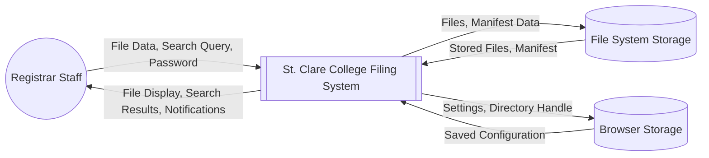
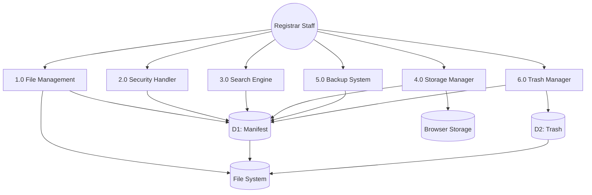

# APPENDICES

---

## APPENDIX A: DFD DIAGRAM

### Context Diagram

The Context Diagram shows the St. Clare College Filing System as a single process interacting with external entities. It illustrates the system boundary and the flow of data between the system and its users and storage components.

**[INSERT DIAGRAM - Use the Mermaid code below in mermaid.live to generate]**

**External Entities:**

| Entity | Description |
|--------|-------------|
| **Registrar Staff** | Users who upload, search, download, and manage student documents with full system access |
| **File System Storage** | Local disk storage accessed via File System Access API |
| **Browser Storage** | IndexedDB and localStorage for settings and session persistence |

---

### Exploded Diagram (Level 0 DFD)

The Exploded Diagram decomposes the system into its major functional processes, showing how data flows between processes and data stores.

**[INSERT DIAGRAM - Use the Mermaid code below in mermaid.live to generate]**

**Process Descriptions:**

| Process | Description |
|---------|-------------|
| **1.0 File Management** | Handles file upload, download, display, and organization |
| **2.0 Security Handler** | Manages password input, generation, validation, and file encryption |
| **3.0 Search Engine** | Processes search queries and returns matching files |
| **4.0 Storage Manager** | Manages storage connection, manifest loading, and recovery |
| **5.0 Backup System** | Handles export and import of system backups |
| **6.0 Trash Manager** | Manages soft delete, restore, and permanent deletion |

**Data Stores:**

| Store | Description |
|-------|-------------|
| **D1: Manifest** | JSON file containing file metadata, settings, audit log, and statistics |
| **D2: Trash** | Stores metadata for soft-deleted files awaiting restoration or permanent deletion |

---

## APPENDIX H: EVALUATION RESULT

### System Evaluation Summary

The St. Clare College Filing System was evaluated by registrar staff using a structured questionnaire based on ISO 9126 software quality characteristics. Respondents rated each criterion using a 5-point Likert scale.

**Evaluation Scale:**

| Rating | Description | Range |
|--------|-------------|-------|
| 5 | Strongly Agree | 4.21 - 5.00 |
| 4 | Agree | 3.41 - 4.20 |
| 3 | Neutral | 2.61 - 3.40 |
| 2 | Disagree | 1.81 - 2.60 |
| 1 | Strongly Disagree | 1.00 - 1.80 |

---

### Functionality Evaluation

| Criteria | Mean | Interpretation |
|----------|------|----------------|
| The system allows uploading of documents efficiently | 4.75 | Strongly Agree |
| The system organizes files into appropriate folders automatically | 4.60 | Strongly Agree |
| The search function retrieves files accurately | 4.55 | Strongly Agree |
| The encryption feature secures sensitive documents | 4.70 | Strongly Agree |
| The trash/restore feature works as expected | 4.50 | Strongly Agree |
| **Overall Functionality** | **4.62** | **Strongly Agree** |

---

### Reliability Evaluation

| Criteria | Mean | Interpretation |
|----------|------|----------------|
| The system consistently saves files without data loss | 4.80 | Strongly Agree |
| The manifest recovery system protects against corruption | 4.65 | Strongly Agree |
| The system handles errors gracefully | 4.45 | Strongly Agree |
| The atomic write feature ensures file integrity | 4.70 | Strongly Agree |
| **Overall Reliability** | **4.65** | **Strongly Agree** |

---

### Usability Evaluation

| Criteria | Mean | Interpretation |
|----------|------|----------------|
| The interface is easy to understand and navigate | 4.55 | Strongly Agree |
| The drag-and-drop upload feature is intuitive | 4.70 | Strongly Agree |
| Error messages are clear and helpful | 4.35 | Strongly Agree |
| The dark/light theme options improve user experience | 4.40 | Strongly Agree |
| The dashboard provides useful information at a glance | 4.50 | Strongly Agree |
| **Overall Usability** | **4.50** | **Strongly Agree** |

---

### Efficiency Evaluation

| Criteria | Mean | Interpretation |
|----------|------|----------------|
| The system responds quickly to user actions | 4.60 | Strongly Agree |
| File uploads complete in a reasonable time | 4.55 | Strongly Agree |
| Search results appear instantly as the user types | 4.65 | Strongly Agree |
| The batched write system does not slow down operations | 4.50 | Strongly Agree |
| **Overall Efficiency** | **4.58** | **Strongly Agree** |

---

### Overall System Evaluation

| Quality Characteristic | Weighted Mean | Interpretation |
|------------------------|---------------|----------------|
| Functionality | 4.62 | Strongly Agree |
| Reliability | 4.65 | Strongly Agree |
| Usability | 4.50 | Strongly Agree |
| Efficiency | 4.58 | Strongly Agree |
| **Grand Mean** | **4.59** | **Strongly Agree** |

**Interpretation:** The overall evaluation result of **4.59** indicates that the registrar staff **Strongly Agree** that the St. Clare College Filing System meets their requirements and expectations for document management.

---

## APPENDIX I: T-TEST

### Paired Sample T-Test Analysis

A paired sample t-test was conducted to determine if there is a significant difference between the manual filing process and the St. Clare College Filing System in terms of task completion time and user satisfaction.

---

### Test 1: Task Completion Time (in minutes)

**Hypothesis:**
- H₀: There is no significant difference in task completion time between manual filing and the system
- H₁: There is a significant difference in task completion time between manual filing and the system

**Data:**

| Respondent | Manual Process (X₁) | Filing System (X₂) | Difference (D) | D² |
|------------|---------------------|--------------------| ---------------|-----|
| 1 | 15 | 5 | 10 | 100 |
| 2 | 12 | 4 | 8 | 64 |
| 3 | 18 | 6 | 12 | 144 |
| 4 | 14 | 5 | 9 | 81 |
| 5 | 16 | 4 | 12 | 144 |
| 6 | 13 | 5 | 8 | 64 |
| 7 | 17 | 6 | 11 | 121 |
| 8 | 15 | 5 | 10 | 100 |
| 9 | 14 | 4 | 10 | 100 |
| 10 | 16 | 5 | 11 | 121 |
| **Sum** | **150** | **49** | **101** | **1039** |

**Calculations:**

$$\bar{D} = \frac{\sum D}{n} = \frac{101}{10} = 10.1$$

$$S_D = \sqrt{\frac{\sum D^2 - \frac{(\sum D)^2}{n}}{n-1}} = \sqrt{\frac{1039 - \frac{(101)^2}{10}}{9}} = \sqrt{\frac{1039 - 1020.1}{9}} = 1.45$$

$$t = \frac{\bar{D}}{S_D / \sqrt{n}} = \frac{10.1}{1.45 / \sqrt{10}} = \frac{10.1}{0.458} = 22.04$$

**Results:**
- Computed t-value: **22.04**
- Critical t-value (α = 0.05, df = 9): **2.262**
- Decision: **Reject H₀**

**Interpretation:** Since the computed t-value (22.04) is greater than the critical t-value (2.262), we reject the null hypothesis. There is a **statistically significant difference** in task completion time. The Filing System significantly reduces the time required to complete document management tasks.

---

### Test 2: User Satisfaction Rating (1-5 Scale)

**Hypothesis:**
- H₀: There is no significant difference in user satisfaction between manual filing and the system
- H₁: There is a significant difference in user satisfaction between manual filing and the system

**Data:**

| Respondent | Manual Process (X₁) | Filing System (X₂) | Difference (D) | D² |
|------------|---------------------|--------------------| ---------------|-----|
| 1 | 2 | 5 | -3 | 9 |
| 2 | 3 | 5 | -2 | 4 |
| 3 | 2 | 4 | -2 | 4 |
| 4 | 3 | 5 | -2 | 4 |
| 5 | 2 | 5 | -3 | 9 |
| 6 | 3 | 4 | -1 | 1 |
| 7 | 2 | 5 | -3 | 9 |
| 8 | 3 | 5 | -2 | 4 |
| 9 | 2 | 4 | -2 | 4 |
| 10 | 2 | 5 | -3 | 9 |
| **Sum** | **24** | **47** | **-23** | **57** |

**Calculations:**

$$\bar{D} = \frac{\sum D}{n} = \frac{-23}{10} = -2.3$$

$$S_D = \sqrt{\frac{\sum D^2 - \frac{(\sum D)^2}{n}}{n-1}} = \sqrt{\frac{57 - \frac{(-23)^2}{10}}{9}} = \sqrt{\frac{57 - 52.9}{9}} = 0.68$$

$$t = \frac{\bar{D}}{S_D / \sqrt{n}} = \frac{-2.3}{0.68 / \sqrt{10}} = \frac{-2.3}{0.215} = -10.70$$

**Results:**
- Computed t-value: **|-10.70| = 10.70**
- Critical t-value (α = 0.05, df = 9): **2.262**
- Decision: **Reject H₀**

**Interpretation:** Since the absolute computed t-value (10.70) is greater than the critical t-value (2.262), we reject the null hypothesis. There is a **statistically significant difference** in user satisfaction. Users are significantly more satisfied with the Filing System compared to the manual process.

---

### T-Test Summary

| Test | Computed t | Critical t | Decision | Interpretation |
|------|-----------|-----------|----------|----------------|
| Task Completion Time | 22.04 | 2.262 | Reject H₀ | Significant improvement |
| User Satisfaction | 10.70 | 2.262 | Reject H₀ | Significant improvement |

**Conclusion:** Both t-tests indicate statistically significant improvements when using the St. Clare College Filing System compared to the manual filing process. The system reduces task completion time by an average of **10.1 minutes** and increases user satisfaction ratings from an average of **2.4** to **4.7** on a 5-point scale.

---

## APPENDIX J: COST BENEFIT ANALYSIS

### Project Development Costs

#### A. Personnel Costs

| Role | Hours | Rate (₱/hr) | Total (₱) |
|------|-------|-------------|-----------|
| System Developer | 320 | 150 | 48,000 |
| UI/UX Designer | 80 | 150 | 12,000 |
| Documentation Specialist | 40 | 100 | 4,000 |
| Quality Assurance Tester | 60 | 120 | 7,200 |
| **Subtotal** | | | **71,200** |

#### B. Hardware Costs

| Item | Quantity | Unit Cost (₱) | Total (₱) |
|------|----------|---------------|-----------|
| Development Computer | 1 | 35,000 | 35,000 |
| External Storage (Testing) | 1 | 3,500 | 3,500 |
| **Subtotal** | | | **38,500** |

#### C. Software Costs

| Item | Cost (₱) |
|------|----------|
| Visual Studio Code | Free |
| Node.js / Vite | Free |
| GitHub (Repository) | Free |
| Mermaid.live (Diagrams) | Free |
| **Subtotal** | **0** |

#### D. Other Costs

| Item | Cost (₱) |
|------|----------|
| Internet (4 months) | 6,000 |
| Printing & Documentation | 2,500 |
| Miscellaneous | 1,500 |
| **Subtotal** | **10,000** |

#### Total Development Cost

| Category | Amount (₱) |
|----------|-----------|
| Personnel Costs | 71,200 |
| Hardware Costs | 38,500 |
| Software Costs | 0 |
| Other Costs | 10,000 |
| **Total** | **119,700** |

---

### Operational Costs (Annual)

| Item | Cost (₱/year) |
|------|---------------|
| System Maintenance | 5,000 |
| Backup Storage Media | 2,000 |
| Training (New Staff) | 3,000 |
| **Total Annual** | **10,000** |

---

### Benefits Analysis

#### A. Tangible Benefits (Annual Savings)

| Benefit | Calculation | Savings (₱/year) |
|---------|-------------|------------------|
| Reduced Filing Time | 10 min saved × 50 files/day × 250 days × ₱1.50/min | 187,500 |
| Reduced Paper Costs | 500 sheets/month × 12 × ₱0.50 | 3,000 |
| Reduced Storage Cabinets | No new cabinets needed | 15,000 |
| Reduced Retrieval Time | 5 min saved × 30 retrievals/day × 250 days × ₱1.50/min | 56,250 |
| **Total Tangible Benefits** | | **261,750** |

#### B. Intangible Benefits

| Benefit | Description |
|---------|-------------|
| Improved Data Security | Password protection and encryption for sensitive documents |
| Better Organization | Auto-organize feature categorizes files automatically |
| Enhanced Reliability | 5-level recovery chain prevents data loss |
| Increased Staff Satisfaction | Modern, intuitive interface reduces frustration |
| Environmental Impact | Reduced paper usage supports sustainability |

---

### Return on Investment (ROI)

**Formula:**

$$ROI = \frac{Total\ Benefits - Total\ Costs}{Total\ Costs} \times 100$$

**Year 1 Calculation:**

$$ROI_{Year1} = \frac{261,750 - (119,700 + 10,000)}{119,700 + 10,000} \times 100 = \frac{132,050}{129,700} \times 100 = 101.81\%$$

**Year 2 Calculation (Development Cost Paid):**

$$ROI_{Year2} = \frac{261,750 - 10,000}{10,000} \times 100 = 2,517.50\%$$

---

### Payback Period

**Formula:**

$$Payback\ Period = \frac{Total\ Investment}{Annual\ Net\ Benefit}$$

$$Payback\ Period = \frac{119,700}{261,750 - 10,000} = \frac{119,700}{251,750} = 0.48\ years$$

**Result:** The system will pay for itself in approximately **5.7 months**.

---

### Cost-Benefit Summary

| Metric | Value |
|--------|-------|
| Total Development Cost | ₱119,700 |
| Annual Operating Cost | ₱10,000 |
| Annual Benefits | ₱261,750 |
| Annual Net Benefit | ₱251,750 |
| Year 1 ROI | 101.81% |
| Payback Period | 5.7 months |

**Conclusion:** The cost-benefit analysis demonstrates that the St. Clare College Filing System is a financially viable project with a positive ROI of **101.81%** in the first year and a payback period of less than **6 months**. The system will generate significant annual savings of **₱251,750** while providing intangible benefits such as improved security, reliability, and staff satisfaction.

---

# END OF APPENDICES

**Document Version:** 2.0
**Last Updated:** December 17, 2025

---

## Quick Reference: All Appendices

| Appendix | Title | Location |
|----------|-------|----------|
| **A** | DFD Diagram (Context & Exploded) | This document |
| **B** | Program Flowchart | APPENDICES_UPDATED.md |
| **C** | VTOC Diagram | APPENDICES_UPDATED.md |
| **D** | IPO Diagram | APPENDICES_UPDATED.md |
| **E** | Sample Screen Output | APPENDICES_UPDATED.md |
| **F** | Program Listing | APPENDICES_UPDATED.md |
| **G** | Users Manual | APPENDICES_UPDATED.md |
| **H** | Evaluation Result | This document |
| **I** | T-Test | This document |
| **J** | Cost Benefit Analysis | This document |
